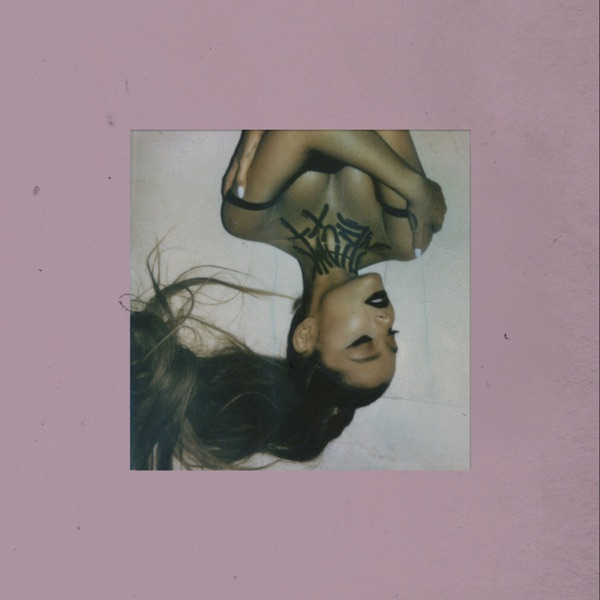
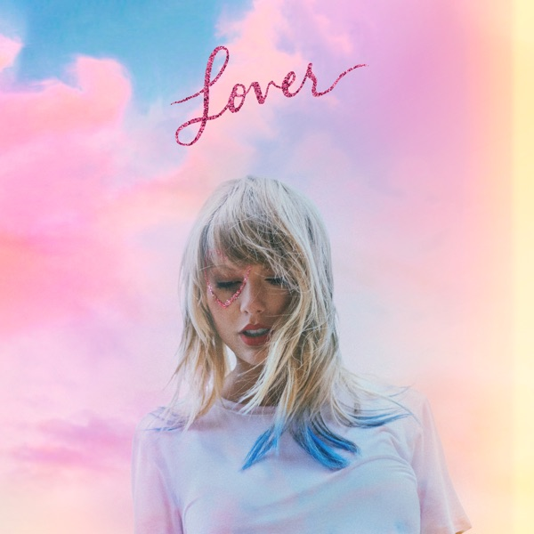
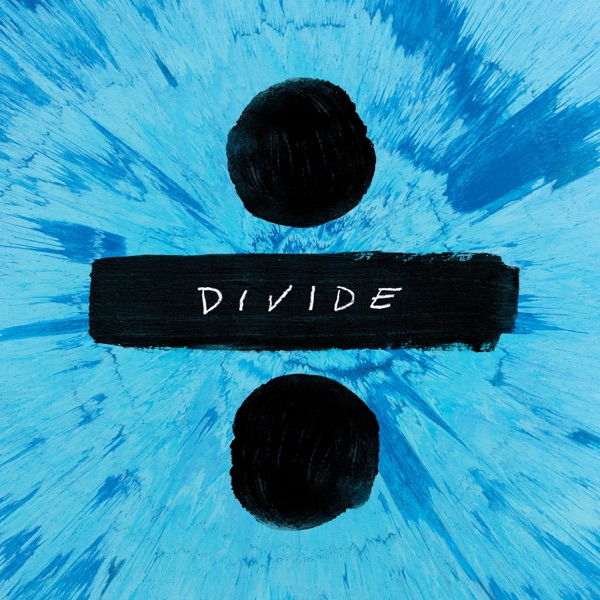

```{r}
#| label: setup
library(tidyverse)
library(plotly)

# Read the analyzed data
features <- read_csv("data/album_features.csv", show_col_types = FALSE)
similarities <- read_csv("data/album_similarity.csv", show_col_types = FALSE)
```

## How Similar Are Pop Album Covers?

To see how much popular album covers look like one another, we extracted visual features from 20 of the biggest pop albums of the last decade:

- **Brightness & Saturation:** Average lightness and color intensity.
- **Colorfulness:** A measure of color variety across pixels.
- **Visual Similarity:** Cosine similarity comparing spatial layout and color distribution.

## Brightness vs. Colorfulness

Hover over each point to see which album it represents. Points are tinted using the album cover's own average color:

```{r}
#| label: fig-colors
#| fig-cap: "Brightness vs. Colorfulness across 20 top pop album covers"

p <- ggplot(features, aes(
  x = brightness,
  y = colorfulness,
  text = paste0(artist, " - ", album, " (", release_year, ")")
)) +
  geom_point(aes(color = avg_color_hex), size = 4) +
  scale_color_identity() +
  theme_minimal(base_size = 13) +
  labs(
    title = "Album Covers: Brightness vs. Colorfulness",
    x = "Brightness (0 = dark, 1 = bright)",
    y = "Colorfulness Index"
  )

ggplotly(p, tooltip = "text")
```

## Top 5 Most Similar Album Pairs

These pairs had the highest visual similarity scores based on their color composition and layout:

```{r}
#| label: tbl-similar
similarities |>
  slice_head(n = 5) |>
  mutate(similarity_pct = scales::percent(similarity, accuracy = 0.1)) |>
  select(
    "Album 1" = album_1,
    "Album 2" = album_2,
    "Similarity" = similarity_pct
  ) |>
  knitr::kable()
```

### Visual Match: Pastel Aesthetics (96.5% Similar)

Ariana Grande's *Thank U, Next* and Taylor Swift's *Lover* share soft pink hues and dreamy textures:

::: {layout-ncol=2}
{width=220}

{width=220}
:::

## Top 5 Most Dissimilar Album Pairs

These pairs showed the lowest visual similarity scores:

```{r}
#| label: tbl-dissimilar
similarities |>
  slice_tail(n = 5) |>
  arrange(similarity) |>
  mutate(similarity_pct = scales::percent(similarity, accuracy = 0.1)) |>
  select(
    "Album 1" = album_1,
    "Album 2" = album_2,
    "Similarity" = similarity_pct
  ) |>
  knitr::kable()
```

### Visual Contrast: High-Key Cyan vs. Dark Contrast (20.6% Similar)

Ed Sheeran's vibrant blue *Divide* contrasts strongly with Billie Eilish's dark, monochromatic cover:

::: {layout-ncol=2}
{width=220}

{width=220}
:::
